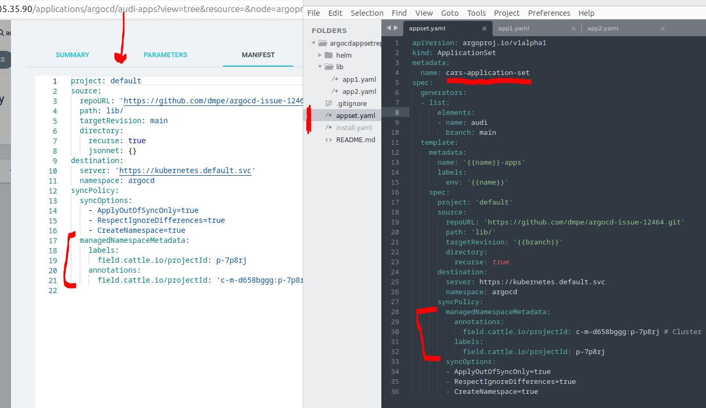
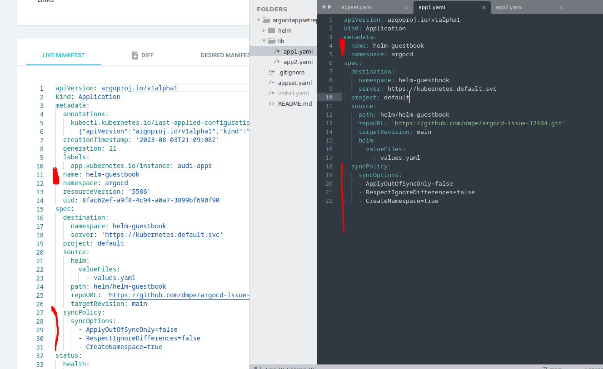

# argocd-issue-12464

https://github.com/dmpe/argocd-issue-12464

`managedNamespaceMetadata` are correctly inherited in the simple case

`managedNamespaceMetadata` are not inherited to downstream applications
when they are referenced by a different `ApplicationSet`

(Situation: `AppSet` creates `ArgoCD Application` which then references actual `ArgoCD` Application that deployes k8s objects)

